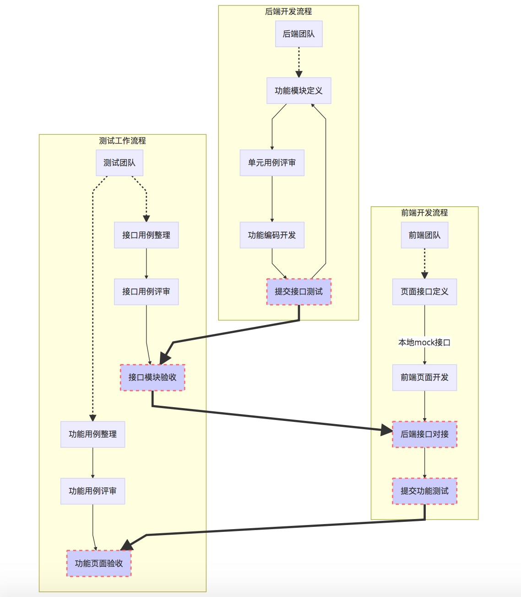

## 前后端分离开发从0到1

> 本文已经授权[InfoQ首发](https://mp.weixin.qq.com/s/e9KQ_ARdz_hniGDA_1zmlw)

**如何前后端分离**? 这个问题, 不同的技术人员,由于所处的岗位不一样,给出的答案都不一样. 

**前后端分离**的问题, 不仅仅是技术上的选型问题,还涉及到整个团队在**认知,职责,流程**上面重新定义的问题,这也是为什么前后端分离概念看起来**简单易懂**,但真正团队在落地的时候,一不小心,往往鸡飞狗跳, 甚至最终放弃"治疗".

> 前后端分离的概述可以参考这篇文章: [前后端分离实践](./team/前后端分离实践.md)

下面, 基于自己之前的对一个团队前后端分离改造的实践经历, 介绍一下**<u>如何打造一个前后端分离的技术团队</u>**.

#### 背景介绍

1. **项目介绍**

   交付一个服务于跨境电商的**<u>供应链金融</u>**项目. 需求已经相对明确, 产品的原型已经出来, 大概有60多个Web端的企业内部信息化的页面, 以平均1个页面2.5个接口来计算, 整个工程差不多有150个接口.

   项目的交付需求还包括技术使用**<u>前后端分离</u>**和**<u>微服务</u>**架构.

   项目交付的时间需求一共是一个半月, 大概7周的时间. 

2. **团队介绍**

   项目团队一共**8**个后端开发, **4**个前端, **2**个QA, **2**个产品, 团队是从其它团队中, 各自抽调出来的, 之前都没有配合过. 

   团队的技术栈是传统的**<u>SpringMVC + JSP + JQuery</u>**, 团队成员对**<u>前后端分离</u>**的概念都只是听说, 并没有任何实操的经历. 

#### **项目启动**

>  **古语云: 兵马未动, 粮草先行**. 

1. **统一认识**

   任何技术团队都是有**<u>惯性</u>**的, **新的变化**(包括新技术, 新的业务, 新的开发模式等)在团队中的**<u>'落地生根'</u>**一般都有一个缓慢的适应过程.

   而碰到这种**<u>时间紧,任务重</u>**的项目, 不仅短期内需要引入这么多新的知识, 并且还要求快速出成果, 团队成员里,眼里都是各种各样的困难, 从而影响到技术人员的心理状态, **<u>产生各种消极的, 甚至排斥的想法</u>**.

   所以, 项目启动的时候, **<u>如何统一认识, 快速让整个团队进入工作状态</u>**, 是最重要的问题.

   1. **划分边界, 确定流程**

      从本质上来说,前后端分离, 相对于前后端混合团队的最大差别就在于,团队内部的分工颗粒度更细. 或者也可以称为更加地解耦, 从而让各个小团队在工作中更加地专注并且高效

      然后,解决分工的问题,相应也要引出协作的问题.把分工颗粒度切细了,边界划分清楚了,相应地也需要定义清楚各个小团队如何去**高效协作**, 这样才能保证即高效,也不会相互干扰.

      所以.前后端分离的第一步,也是最关键的一步,就是梳理清楚**开发流程**,及相应的**角色职责**. 

      1. **角色职责**

         * **前端团队**

           > 负责页面展现的接口设计, 功能页面的开发. 并最终提交给QA做功能测试

         * **后端团队**

           > 负责后端的功能模块实现;根据前端定义的接口实现对外接口;

         * **测试团队**

           > 负责衔接前端和后端团队

      2. **开发流程**

         

         如上图所示, 里面定义出了三个团队在前后端分离的流程中, **<u>各自的工作内容</u>**. 其中最需要关注的就在于中间**<u>各个团队相互衔接</u>**的流程.

         * **提交接口测试**

           > **后端团队 -> 测试团队**. 
           >
           > 后端团队按功能模块开发完接口,提交给测试团队进行集成接口测试

         * **后端接口对接**

           > **测试团队 -> 前端团队**
           >
           > 测试团队验收完接口后,可以移交给前端团队进行页面级别的接口接入.

         * **提交功能测试**

           > **前端团队 -> 测试团队**
           >
           > 前端团队完成了产品的包括页面及接口上对接的工作后,就可以提交给测试团队进行最终的功能页面验收了

   2. **过程性文档**

      开发流程中,每一个**<u>核心的环节</u>**,特别是涉及到**<u>多方分工协作</u>**的环节,都需要有指定的文档输出及相应的评审. 

      前后端分离中, 其中比较重要的过程性文档有如下四个:

      1. **接口契约文档**

         > 用于定义前端与后端之间的接口定义

         * **责任方**: 前端团队

           > 第一个版本的接口契约定义, 一定是前端团队出的. 是的,你没有看错, 后端团队并不适合出接口的定义,因为前端团队的思维方式是**<u>基于页面交互</u>**来考虑的, 后端团队的思维方式是**<u>基于结构化实体</u>**来考虑的.

         * **评审方**: 后端团队, 测试QA, 产品经理

      2. **集成测试用例文档**

         > 用于定义验收接口的用例

         * **责任方**: 测试QA团队
         * **评审方**: 后端团队, 产品经理

      3. **功能测试用例文档**

         > 用于定义验收页面功能的用例

         * **责任方**: 测试QA团队
         * **评审方**: 前端团队, 产品经理

      4. **单元测试用例文档**

         > 用于定义后端各个功能模块的单元用例

         * **责任方**: 后端团队
         * **评审方**: 后端团队, 产品经理

2. **技术框架**

   前后端分离,技术团队的框架选型也是需要重点考虑的,一般这个职责都是**<u>各端开发的技术负责人</u>**来组织调研,并确定最终的框架.

   * **技术框架的选型方式**
     * **编程语言**

       不同团队的编程语言基础技术栈都不一样, 比如有些团队熟悉**PHP**, 有些团队甚至基于**GO**等, 更多的核心考量点还是在于, **<u>团队成员接受度高, 编程语言生态活跃度</u>**这几个维度. 

     * **框架选型**

       编程语言之上的各种框架选型,如网络框架,数据库框架等, 更多的还是基于技术负责人的架构经验来进行选型. 只要记住一个原则: **<u>没有通用的框架,只有合适的框架</u>**

   * **团队最终的框架选型**

     * **前端框架**

       * **编程语言**: **[ECMAScript](http://es6.ruanyifeng.com/) + [React](https://github.com/facebook/react)**

         > **React**, **Angular**, **Vue**都是优秀的前端框架, 选择上更偏向于**Github**上面的生态中, React是[**最活跃, 关注度最大**](https://github.com/search?utf8=%E2%9C%93&q=react&type=)的层面上来考量的.

       * **开发框架**: **[DVA](https://github.com/dvajs/dva)** **+** **[Ant-design](https://github.com/ant-design/ant-design)** 

         > 阿里开源的基于**React**的框架的封装, 其中有一个示例性的**demo**工程[**antd-admin**](https://github.com/zuiidea/antd-admin), 可以在团队刚起步的时候, 快速进入开发流程

     * **后端框架**

       * **编程语言**: **[Java8](https://www.tutorialspoint.com/java8/)**

         > 后端开发是**Java**团队, 不过建议使用**Java8**之前先做**Java8**的培训,特别是**Lambda**, **Optinal**相关使用方法,应用场景相关的新特性培训. 

       * **开发框架**: **[SpringBoot](https://docs.spring.io/spring-boot/docs/current-SNAPSHOT/reference/htmlsingle/)**

         > 一个好像不需要过多解释的框架....

     * **集成测试框架**

       > 如果团队中的测试QA尚不俱备技术开发能力,建议使用**[Postman](https://www.getpostman.com/)**来进行集成接口测试

       * **编程语言**: [**Python**](https://www.python.org/)

         > 测试开发最方便的编程语言

       * **开发框架**: [**Pytest**](https://docs.pytest.org/en/latest/)

         > 测试用例框架

#### **项目管理**

> **万事俱备,只欠开'操' ….**

1. **定义0.1的里程碑**

   所有技术框架都只是调研的,所有流程都只是浮于表面的...

   项目开工的第一个核心任务就是讨论出**<u>最小的工程子集</u>**, 目标是可以**<u>跑通所有的流程及相应的技术框架</u>**.

   整个团队形成一个共识, 然后启动开发. 从0到0.1的过程中, 会碰到大量的问题, 这些问题只要不阻塞开发流程的推进, 即使处理得磕磕碰碰的, 都可以暂时放一边. 比如说文档的格式如何写, 代码的风格之类的. 

   当0.1的里程碑完成后,整个团队会对前后端分离, 不管是流程上,还是技术上,都会有一个基本的认识, 并且, 会有一定的成就感. 这也代表前后端分离已经有了**<u>一个好的开端</u>**了.

2. **前后端进度分离**

   当团队熟悉前后端分离的流程后, 前端团队和后端团队的进度就可以考虑彻底分开了.

   * **前端团队的进度**

     可以基于Mock接口的方式, 分成三个阶段:

     1. **按页面划分,快速出所有的页面**

        > 只考虑量,不考虑质,以基本跑通所有的Mock接口为标准. 
        >
        > 这里更多的考虑在于,前端接触新的框架,会积累很多问题,包括CSS之类的,包括接口调用之类的, 这些问题都有共通性, 可以在下一次迭代的时候, 总结出问题, 分不同的人去解决.

     2. **基于所有的页面进行迭代**

        > 划分不同的人去解决团队积累下来的问题, 并统一修复.可以尝试抽出一些共性的组件

     3. **分批接入后端的模块接口**

        > 到这个阶段的时候,后端的接口理论上QA根据模块, 已经验收了一部分了, 可以开始分批接入,并最终提交给QA进行功能上的测试

   * **后端团队的进度**

     1. **按模块切分开发, 接口分批提交验收**

        > 后端可以基于业务来切分子模块, 然后, 各个模块并行开发. 接口实现后, 由QA去进行集成用例的验收. 

   * **测试团队的工作内容**

     QA在前后端分离流程,扮演着足球**'中场'**的角色,这个角色把前端团队这个**'前场'**和后端团队这个**'后场'**,串联起来,承上启下, 让他们可以各司其职,降低相互之间的耦合性.

     核心工作就三个部分:

     1. **分批次验收后端的模块接口**

        > 在**没有页面**的前提下, 使用工具, 参考集成测试用例,对接口的健壮性, 可靠性进行详细验证, 保证在前端页面开始接入接口的时候, **接口是稳定可靠**的.

     2. **分批次验收前端的功能页面**

        > 基于功能测试用例, 进行页面级别上的功能回归

     3. **整合前后端的BUG信息**

        > 前后端的BUG信息全部是反馈给QA, 由QA统一去追相应的技术人员. 比如说前端发现有个接口有问题, 只反馈给QA, 剩下的工作就是由QA去找相应的后端负责人.

3. **从1到N的迭代**

   > **耐心及专注**

   团队的技术成长都是<u>**有节奏的**</u>,是没有办法一步到位的. 

   做为项目或者技术负责人, 在这个时候, 要有相对宽容的心态是看待这个问题. 

   随着项目一次次迭代, 会引出一个个问题, 比如说, 如何<u>**更加**</u>有效地写单元测试用例, 如何<u>**更加**</u>有效的提高页面的渲染效率, 如何让页面的组件**<u>更加</u>**的通用化. 

   请注意<u>**"更加"**</u>这个词, 团队在不断解决<u>**"更加"**</u>的问题过程中, 也是不断成长的过程. 最终, 整个技术团队会演化成一个高效分工,专注各自领域的前后端分离的快速开发的团队.

   ​

