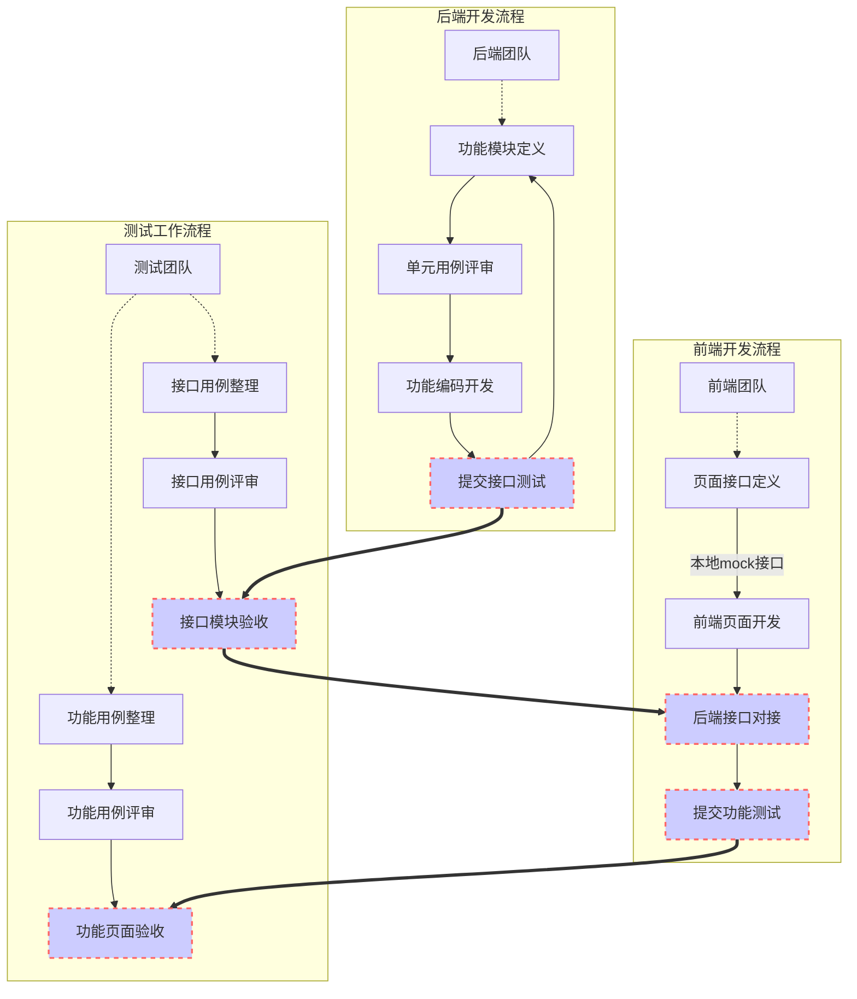

```mermaid
graph TB
    subgraph 后端开发流程
    后端团队-.->功能模块定义
    功能模块定义-->单元用例评审
    单元用例评审-->功能编码开发
    功能编码开发-->提交接口测试
    提交接口测试-->功能模块定义
    end
    subgraph 测试工作流程
    测试团队-.->接口用例整理
    测试团队-.->功能用例整理
    接口用例整理-->接口用例评审
    接口用例评审-->接口模块验收
    功能用例整理-->功能用例评审
    功能用例评审-->功能页面验收
    end
    subgraph 前端开发流程
    前端团队-.->页面接口定义
    页面接口定义-->|本地mock接口|前端页面开发
    前端页面开发-->后端接口对接
    后端接口对接-->提交功能测试
    end
    提交接口测试==>接口模块验收
    接口模块验收==>后端接口对接
    提交功能测试==>功能页面验收
    style 提交接口测试 fill:#ccf,stroke:#f66,stroke-width:2px,stroke-dasharray: 5, 5
    style 接口模块验收 fill:#ccf,stroke:#f66,stroke-width:2px,stroke-dasharray: 5, 5
    style 后端接口对接 fill:#ccf,stroke:#f66,stroke-width:2px,stroke-dasharray: 5, 5
    style 提交功能测试 fill:#ccf,stroke:#f66,stroke-width:2px,stroke-dasharray: 5, 5
    style 功能页面验收 fill:#ccf,stroke:#f66,stroke-width:2px,stroke-dasharray: 5, 5
```