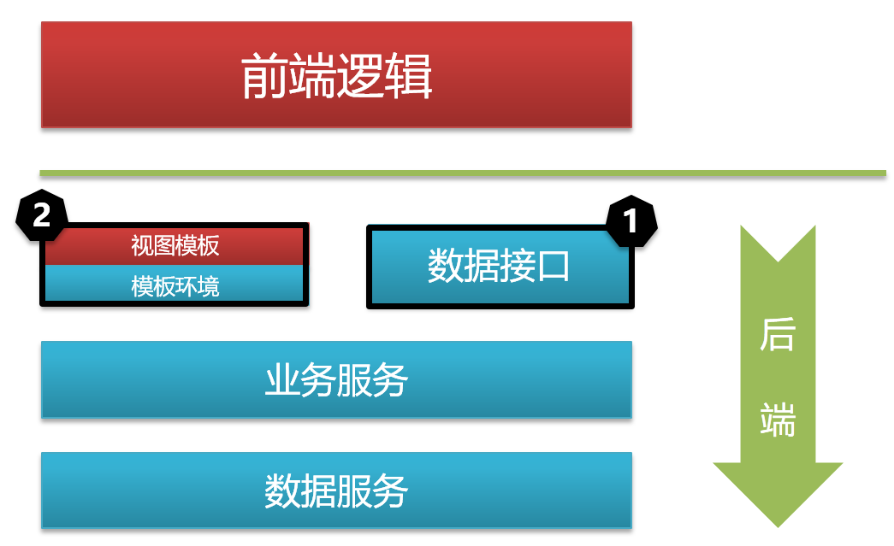
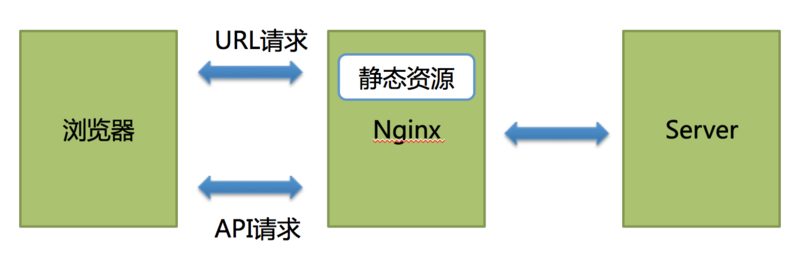
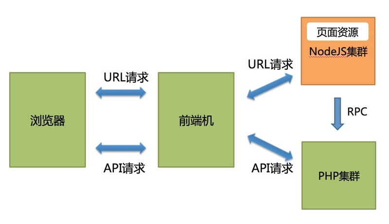
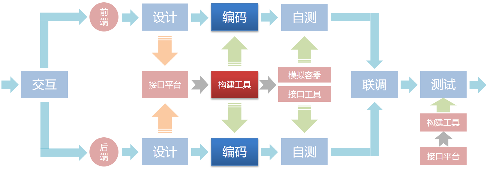

# 前后端分离实践

本文主要探讨前后端分离上的实践问题，并介绍在实践过程中需要注意的地方

## 内容

前后端的分离我们主要从以下几个方面来介绍

* 整体介绍
* 解决方案
* 协作体系
* 注意事项

## 背景介绍

前后端分离已经拥有很多个比较成熟的方案技术方案，这里面也包括web端，移动端的.本文主要介绍WEB系统相关的前后端架构模型，其实移动端系统也是类似，区别并没有这么大，只是移动端前端的框架的选择上需要考虑更多的内容

上图是WEB系统的一个高层级分层模型，在这个模型中**红色部分**表示前端要做的事情，**蓝色部分**表示后端要做的事情

在这种模型下我们可以看到：

1. 数据接口： 相当于前后端双方的**契约**
2. 视图填充： 现有的前后端解决方案主要有两种

    * 静态页面

    * 服务器代理

所以我们在挑选前后端分离方案的时候，讨论的中心还是基于这两个核心要解决的问题，当然除此之外，我们还得考虑团队的人员技能能力，还有相应的方案规范化、自动化等，最终能够输出一套合适的工程指导公司新旧项目的开展

* 数据接口的方案

  1. 基于http Rest + json的解决方案

    * 优点:
        * 公用api的标准定义
        * 成熟，平台通用性强，支持各种异构的环境及网络环境
        * 各种编程语言都支持，调试及做各种自动化测试都方便
    * 缺点:
        * http 1.0的协议及序列化，在一些对性能及效率上的场景下并不适用，比如说内部微服务之间的高并发，大流量调用等.并且浏览器会对http的并发请求数有限制，很多大型的门户网站就需要针对性的进行优化.
        * rest的语义过于简单，基于资源隔离的语义表达并不适合前端基于聚合数据展示的需求.
    * 相关的辅助工具:
        * [swagger框架](https://swagger.io/)
        > 使用swagger的schema来约定前后端的接口，并且可以使用其自动化的工具来生成相应的代码

  2. [基于facebook的Graphql框架](http://graphql.org/)

    * 优点:
        * 基于聚合数据协议
        * 协议迭代及效率比较高
    * 缺点:
        * 框架较新，学习门槛较高
        * 生态还没有建立起来，调试及自动化测试比较不方便，需要有一个翻译契约的过程

  3. [基于google的grpc框架](https://grpc.io/)

    * 优点: 
        * 基于http 2.0协议，封装和传输效率都高
        * 支持各种主流语言
    * 缺点:
        * 基于protobuf封装，学习门槛相对较高
        * 更适用于移动端的应用

对刚接触前后端分离的团队，一般都建议从http rest的方案开始入手.

* 视图填充的框架

  1. 静态资源

    前端框架生成所有的静态资源，部署到静态服务器上面，浏览器在下载后，访问后端提供的api服务器

    

    * 优点:
        * 方案比较简单，易于实现
    * 缺点:
        * 无法使用服务器端渲染的性能优化

  2. 服务器代理

    在静态服务器上面，单独增加一个Node Server作为中间层，将前端资源部署到Node Server中。Node Server还实现了一层数据代理服务，负责与提供数据的后端服务进行通信。

    

    * 优点:
        * 可以使用服务器端渲染
        * 隐藏后端复杂的交互，如权限认证等
    * 缺点:
        * 开发及部署复杂，前端团队需要了解node服务器相关的技术

  3. 前端框架

    * [facebook的React](https://facebook.github.io/react/)

        * 优点: 
            1. 拥有最大的前端开源生态圈，各种开源组件都能找到
            2. 组件化的设计，利于组件的封装及共享
            3. 逻辑层与View层分离，适合团队的分工协作
        * 缺点:
            1. 学习门槛高

    * [vue](https://cn.vuejs.org/)

        * 优点:
            1. 中文的开源社区，对国人相对友好
            2. html模板化的语义，对jqeury的开发者入门友好
            3. 吸收了react和angular的优点，越来越国际化
        * 缺点:
            1. 相对适合人数少的开发团队

    * [google的angular](https://angular.io/)

        * 优点:
            1. MVC的架构，后端容易了解入手
        * 缺点:
            1. 2.0对1.0的升级基本是破坏性的
            2. 需要学习Typescript的语言，门槛较高

以上的框架都可以是静态或者服务器代理的方式.并且都有应用于生产环境的实际用例.更多还是看团队的技术偏向

## 协作体系

有了前面我们对这套解决方案的整体认识后，接下来我们再来看一下各端在该解决方案的指导下是如何进行协作的

这是WEB系统前后端协作的流程，这个流程中我们可以看到在有了交互输出之后，各角色（包括视觉、前端、后端）就可以并行的开始展开各自的流程了

在解决方案中我们可以看到在系统设计阶段各端根据**交互稿利用接口管理平台输出接口规范**，后续流程各端针对接口规范进行编码、自测，所以这里**接口规范是整个方案的核心**，是保证各端可以独立并行的先决条件

从上面的流程中可以看到在我们解决方案的整个体系中涉及的平台、工具包括(这里简单的以**swagger**的使用来举例):

* **接口管理平台**

  > 该平台主要用来管理接口规范数据，是整个解决方案的核心，有了规范以后就可以做自动化，后续各效率工具均可以从该平台获取规范信息做自动化相关工作. 如，使用[SwaggerUI的schema](https://swagger.io/swagger-ui/)来定义接口规范

* **工程构建工具**

  > 根据接口管理平台的规范定义，配合项目已有的工程规范，自动生成项目工程、工具配置、页面代码、模拟数据、测试代码、用例数据等等. 如，使用[Swagger的Codegen](https://swagger.io/swagger-codegen/)自动化生成项目的工程，测试代码等

* **本地模拟容器**

  > 提供给前端开发过程用于本地运行调试页面的环境，具备WEB服务基本功能、模板解析、请求代理等功能. 如，使用[mockjs](http://mockjs.com/)进行本地的数据模拟

* **接口测试工具**

  > 提供给后端开发、测试过程用于模拟浏览器发起异步请求，工具对接接口管理平台直接导入规范信息、管理测试人员的用例数据、支持直接导出自动化测试代码和用例数据. 可以使用[Postman](https://www.getpostman.com/)或者[Swagger的Codegen](https://swagger.io/swagger-codegen/)生成的脚本框架等

接下来我们再来简单介绍一下各角色在此方案下独立开展各自的工作流程

* **前端**

  > 前端借助于接口管理平台和本地模拟容器从后端独立出来，通过接口管理平台获取到页面预填、异步接口的mock数据（这个过程可以直接在本地mock），通过本地模拟容器隔离真实服务环境完成WEB服务、模板解析和请求代理功能

* **后端**

  > 后端基于接口，独立进行开发，开发结束后，使用mock的数据进行**契约接口测试**

* **测试**

  > 测试是**保证接口管理平台规范一致性**的重要环节，项目提测之后首先要做的是一次**契约接口测试**，如果被验收失败的，那么此次提测会被打回重新检查.

  > 在这个阶段，**契约接口测试**是可以使用自动化的工具或者平台来介入，让项目更有效率

  > 在**契约接口测试**验收成功后，才会进入页面相关的功能测试环节.

## 注意事项

* 契约接口的定义

    * 第一个版本的接口定义，是**前端**根据视觉交互确定出来的
    * **产品，后端，测试**介入评审确认接口的定义

* 测试(QA)的职责

    * 负责验收后端的接口实现，只有验收成功后，前端才最终**参与联调**
    * 负责基于接口的**集成测试用例**的编写